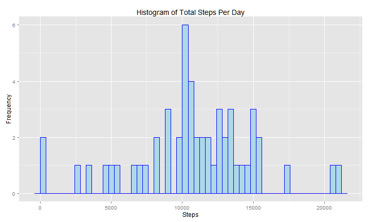
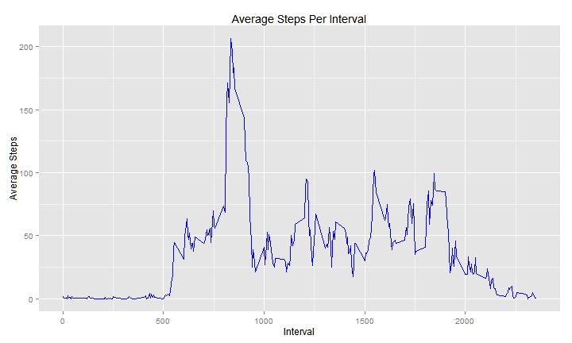
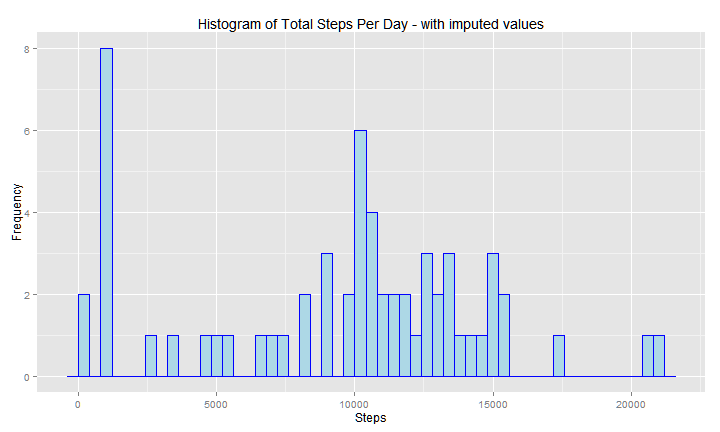
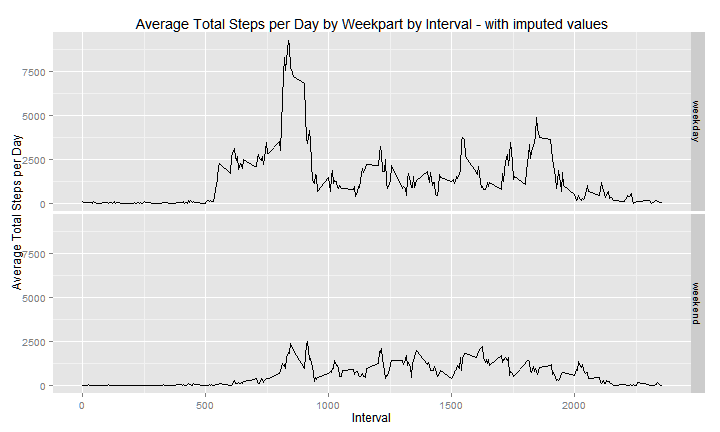

# Reproducible Research: Peer Assessment 1

## Loading and preprocessing the data

We'll use data.table instead of data.frame, and ggplot2 for graphics.  Set knitr options, allow printing of larger numerics in fixed format.  Read in the data and convert the character date column to the date class.   


```r
library(data.table)
library(ggplot2)
library(knitr)

opts_knit$set(progress=FALSE)
opts_chunk$set(echo=TRUE, message=FALSE, tidy=TRUE, comment=NA,
               fig.path="figure/", fig.keep="high", fig.width=10, fig.height=6,
               fig.align="center")

options(scipen=10)

setwd('~/R_projects/jhuds/RepData_PeerAssessment1')
rawdata <- fread('activity.csv')
dt0 <- rawdata[, date := as.Date(date)] 
```

## What is mean total number of steps taken per day?

Create a summary data.table rolling up total steps taken by day, then plot histogram 


```r
dt1 <- dt0[, list(tot_spd = sum(steps)), by = date]
g1 <- ggplot(dt1, aes(x = tot_spd))
g1 <- g1 + geom_histogram(binwidth = 400, fill = "lightblue", col = "blue")
g1 <- g1 + ggtitle("Histogram of Total Steps Per Day")
g1 <- g1 + ylab("Frequency")
g1 + xlab("Steps")
```



Calculate the mean and median, ignoring any missing values. 

```r
mean_spd <- mean(dt1$tot_spd, na.rm = TRUE)
median_spd <- median(dt1$tot_spd, na.rm = TRUE)
```
The mean number of setps per day is 10766.1887 and the median is 10765

## What is the average daily activity pattern?

Create a summary data.table rolling up total steps taken by interval, then make a time series plot showing average number of steps taken, averaged across all days for each 5-minute interval


```r
dt2 <- dt0[, list(avg_spi = mean(steps, na.rm = TRUE)), by = interval]

g2 <- ggplot(dt2, aes(x = interval, y = avg_spi))
g2 <- g2 + geom_line(binwidth = 400, fill = "lightblue", col = "blue")
g2 <- g2 + ggtitle("Average Steps Per Interval")
g2 <- g2 + ylab("Average Steps")
g2 + xlab("Interval")
```



Find the 5-minute interval, on average across all the days in the dataset, that contains the maximum number of steps.


```r
max_steps_interval <- dt2[avg_spi == max(avg_spi), interval]
```

The 5-minute interval that contains the maximum mean number of setps averaged across all days is 835

## Imputing missing values

Identify the columns that have NA values.  


```r
summary(dt0)
```

```
     steps            date               interval   
 Min.   :  0.0   Min.   :2012-10-01   Min.   :   0  
 1st Qu.:  0.0   1st Qu.:2012-10-16   1st Qu.: 589  
 Median :  0.0   Median :2012-10-31   Median :1178  
 Mean   : 37.4   Mean   :2012-10-31   Mean   :1178  
 3rd Qu.: 12.0   3rd Qu.:2012-11-15   3rd Qu.:1766  
 Max.   :806.0   Max.   :2012-11-30   Max.   :2355  
 NA's   :2304                                       
```

Only the `steps` column is missing data.  Create a copy of the original data.table to receive imputed values. Build a vactor indentifying the problem rows, then impute missing values by finding the median value within each interval, and check that we have addressed all NAs.    


```r
dt_imp <- dt0
nas <- which(is.na(dt_imp$steps))
dt_imp$steps[nas] <- with(dt_imp, ave(steps, interval, FUN = function(x) median(x, 
    na.rm = TRUE)))[nas]
summary(dt_imp)
```

```
     steps          date               interval   
 Min.   :  0   Min.   :2012-10-01   Min.   :   0  
 1st Qu.:  0   1st Qu.:2012-10-16   1st Qu.: 589  
 Median :  0   Median :2012-10-31   Median :1178  
 Mean   : 33   Mean   :2012-10-31   Mean   :1178  
 3rd Qu.:  8   3rd Qu.:2012-11-15   3rd Qu.:1766  
 Max.   :806   Max.   :2012-11-30   Max.   :2355  
```

Summarize total steps taken per day using imputed data set, calculate mean and median, and plot histogram.  

```r
dt3 <- dt_imp[, list(tot_spd = sum(steps)), by = date]
imp_mean_spd <- mean(dt3$tot_spd)
imp_median_spd <- median(dt3$tot_spd)

g3 <- ggplot(dt3, aes(x = tot_spd))
g3 <- g3 + geom_histogram(binwidth = 400, fill = "lightblue", col = "blue")
g3 <- g3 + ggtitle("Histogram of Total Steps Per Day - with imputed values")
g3 <- g3 + ylab("Frequency")
g3 + xlab("Steps")
```



### Before and after imputation 

#### Mean
Before imputation the mean was 10766.1887, after imputation it was 9503.8689

#### Median
Before imputation the median was 10765, after imputation it was 10395

## Are there differences in activity patterns between weekdays and weekends?

To create a factor identifying weekday vs. weekend, we'll build a vector with row ids for weekeend dates.  The set difference of these and all rows are the weekdays.
Summarize total steps taken by day by interval.


```r
we_rows <- which(weekdays(dt_imp$date) %in% c("Saturday", "Sunday"))
wd_rows <- setdiff(1:nrow(dt_imp), we_rows)

dt_imp <- dt_imp[we_rows, `:=`(weekpart, "weekend")]
dt_imp <- dt_imp[wd_rows, `:=`(weekpart, "weekday")]

dt_imp$weekpart <- as.factor(dt_imp$weekpart)

dt4 <- dt_imp[, list(tot_spd = sum(steps)), by = list(weekpart, interval)]
```

Create 2 time series plots of the 5-minute interval and the average number of steps taken, one averaged across all weekdays and the other across all weekends.  The factor we created will split the facets.


```r
g4 <- ggplot(dt4, aes(x = interval, y = tot_spd))
g4 <- g4 + geom_line()
g4 <- g4 + facet_grid(weekpart ~ .)
g4 <- g4 + ggtitle("Average Total Steps per Day by Weekpart by Interval - with imputed values")
g4 <- g4 + ylab("Average Total Steps per Day")
g4 + xlab("Interval")
```


